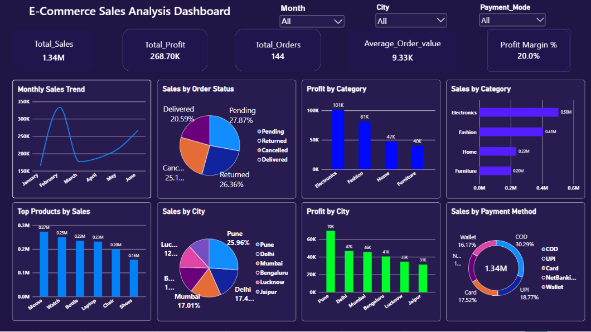

# E-Commerce Sales Analysis Dashboard

## Project Overview
An interactive Power BI dashboard analyzing e-commerce sales,
profit, orders, products, categories, cities, and payment methods.

## Tools Used
- Power BI
- Excel
- DAX
- Data Cleaning
- Data Visualization

## Key KPIs
- Total Sales: 1.34M
- Total Profit: 268.70K
- Total Orders: 144
- Average Order Value: 9.33K
- Profit Margin: 20%

## Dashboard

## Key Insights
- Electronics generated the highest profit.
- Pune generated the highest sales among cities.
- COD was the most-used payment method.
- Mouse was the top product by sales.
